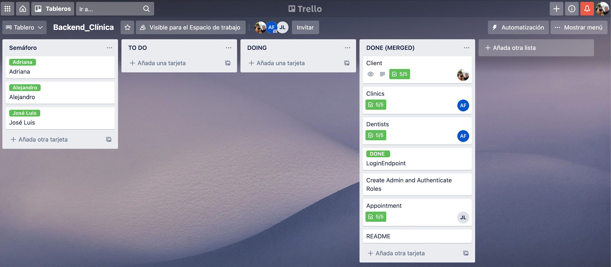
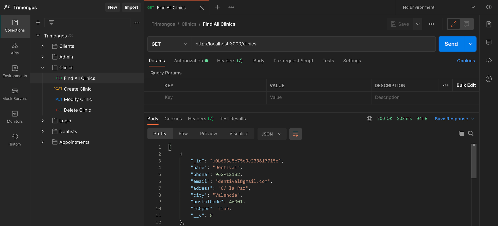
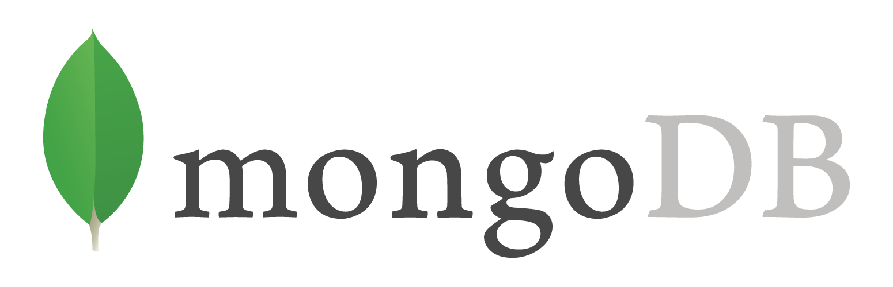

<h1 align="center">
   🦷 Dental Clinic Backend 🦷
</h1>

---

- [About](#about)   

- [Instructions](#instructions)

- [Endpoints](#endpoints)

- [Tools](#tools)

- [Developers](#developers)

---

## About :speech_balloon:

Challenge from the Fullstack Developer Bootcamp at <a href="https://geekshubsacademy.com/">GeeksHubs Academy</a> where we have to create the backend for a dental clinic.

The purpose of our backend is to support an on-demand and flexible private dental service model, this translates into clients being able to choose which clinic and which dentist will provide the service. To do this, they just have to register, choose a clinic and select the best specialist for the date.

Specialists will be able to register, fill their profile, add new specialities and check their schedule to know how many dates they have each day.
Clients will also be able to check their dating history on their profile.

The administrator is a figure who has complete control of the database and its information. Admin is the only one who can give the authorization to create new dentists profiles.

---
This Project has been done by [José Luis Aparicio](https://github.com/ApcarJo), [Alejandro Urbina](https://github.com/2020-JAUG) and [Adriana Fayos](https://github.com/AdrianaFayos). 
The amount of hours to get the job done was about 75 hours in total.

Starting date: May 21th 2021.  
Due date: June 6th 2021.

We have used the Trello in order to share the tasks and to have a better organization.

 
## Instructions :clipboard: 

The first step is to clone the repository and install the project dependencies.

### `npm i`

Run the server.

### `npm start`

Finally, enter the endpoints petitions in Postman and send them.

## Endpoints :mailbox:

- Clients
   - GET /clients --> Shows all the clients.
   - POST /clients --> Creates a new client.
   - POST /clients/profile --> Shows client's profile.
   - PUT /clients --> Modifies a client's information.
   - DELETE /clients --> Deletes a client.

 

- Appointments
   - GET /appointment --> Shows all the appointments.
   - POST /appointment/schedule --> Shows dentist’s schedule by date.
   - POST /appointment/client --> Shows all appointments from the same client.
   - POST /appointment --> Creates a new appointment.
   - PUT /appointment --> Modifies an appointment information.
   - DELETE /appointment --> Deletes an appointment.

 

- Clinics
   - GET /clinics --> Shows all the clinics.
   - POST /clinics --> Creates a new clinic.
   - POST /clinics/profile --> Show clinic by id.
   - PUT /clinics --> Modifies a clinic's information.
   - DELETE /clinics --> Deletes a clinic.
 

- Dentists
   - GET /dentists --> Shows all the dentists.
   - POST /dentists/profile --> Shows dentist's profile
   - POST /dentists --> Creates a new dentist.
   - POST /dentists/addspeciality --> Adds a new speciality to a dentist
   - PUT /dentists --> Modifies a dentist's information.
   - DELETE /dentists --> Deletes a dentist.
 

## Tools 🔧

   

Installed dependencies: Express, Mongoose, Nodemon, Cors, Bcrypt and Jsonwebtoken.

## Developers ✍️

[José Luis Aparicio](https://github.com/ApcarJo) 

[Alejandro Urbina](https://github.com/2020-JAUG)

[Adriana Fayos](https://github.com/AdrianaFayos)

---

Thanks to all our classmates for the help and work as a great team.
Specially last minute Pedro's help with a struggle with an array.

[🔝](#top)
